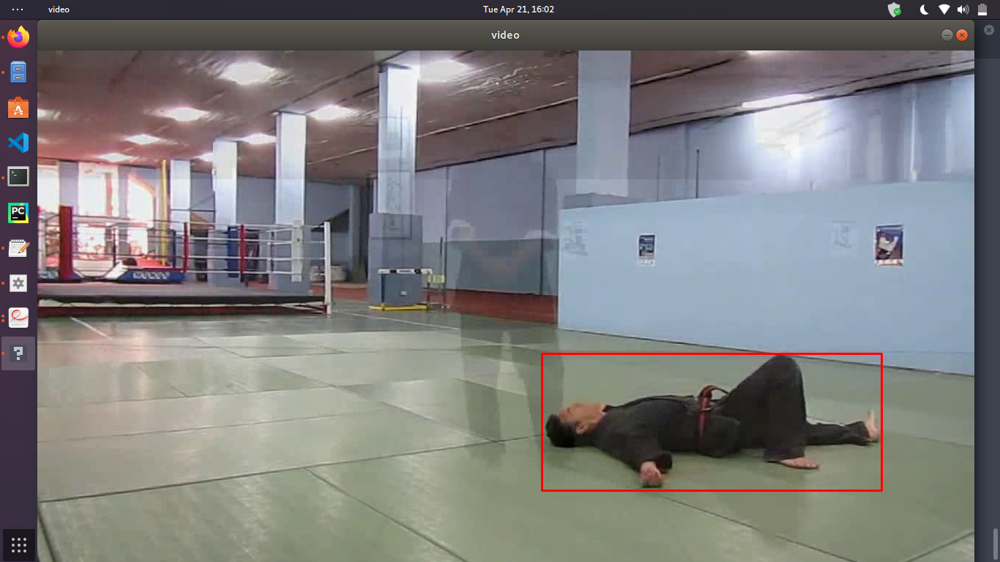
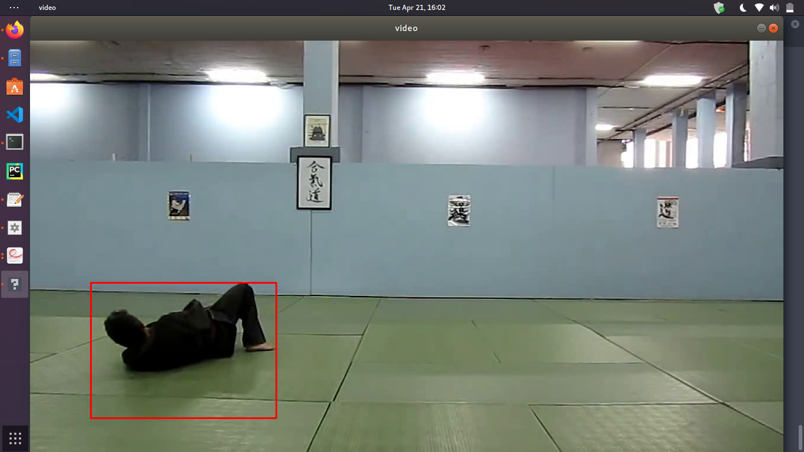
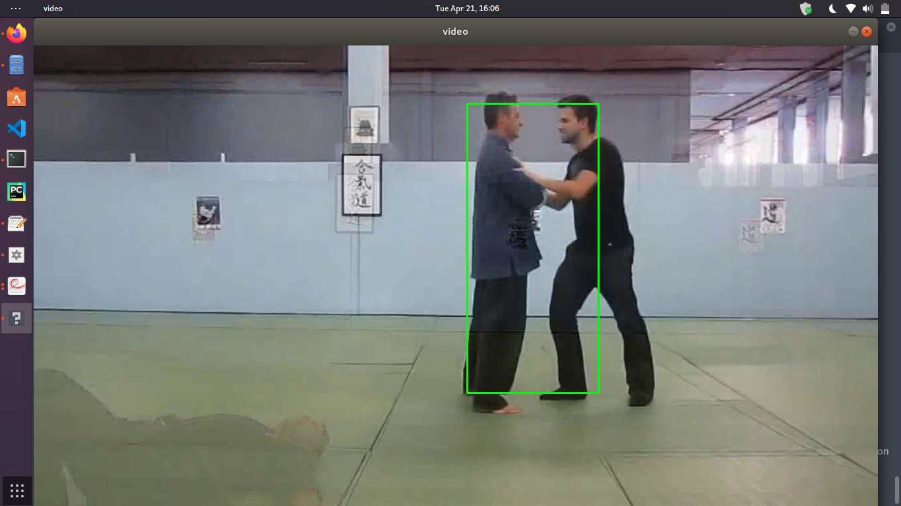
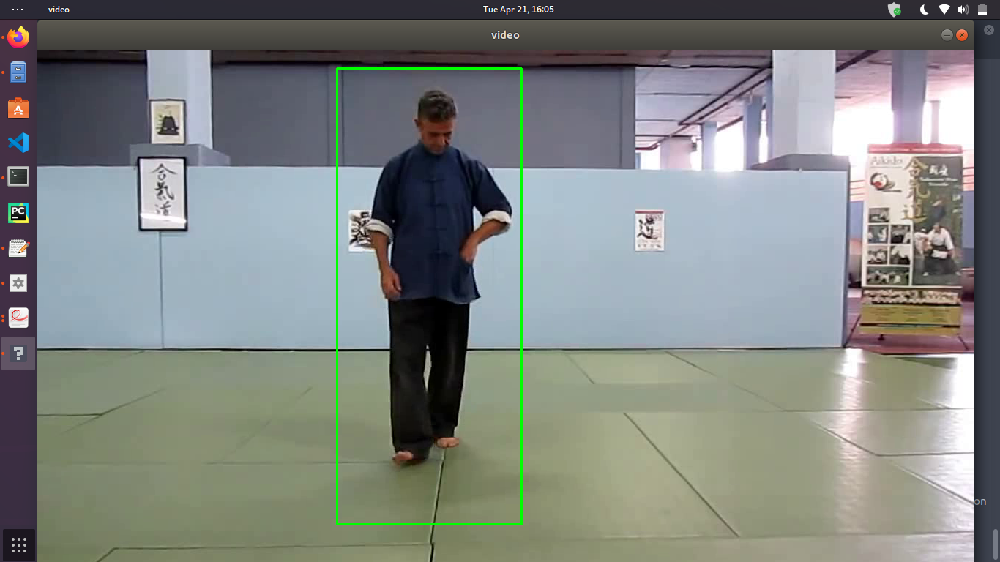
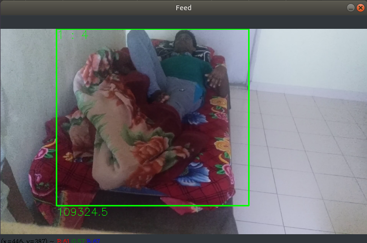
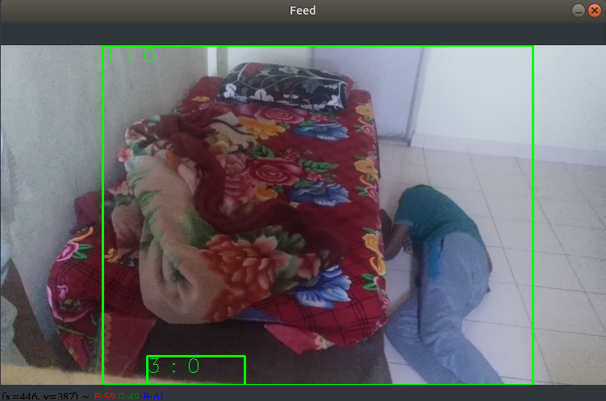
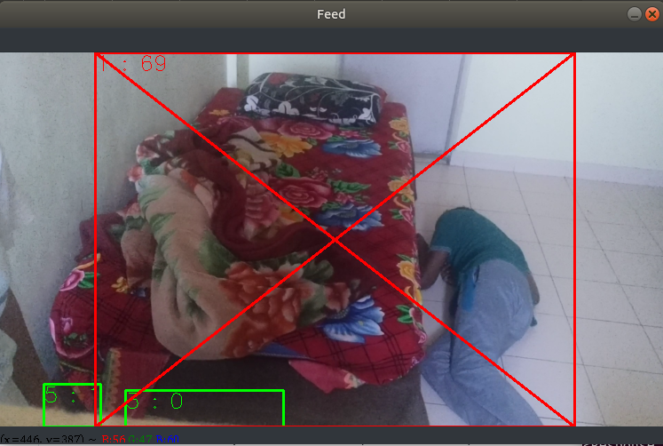

## Person Fall Detection using OpenCV

## 1. Version 0

### Getting the video:
* The program gets the video from the source or path which is passed to it.
* Then we create a background subtractor ``fgbg``.

### Within the while(1) loop: 
* It **converts each of the frames to grayscale** and **applies Background Subtractor on the image**.
* The ``cv2.findContours()`` takes in the **source image, the contour retrieval mode and contour approximation method to give image, contours and hierarchy**. 
* ``contours`` is a Python list of all the contours in the image.
* We then try to find area of contours from a frame. To do that we have used ``cv2.contourArea(contour)`` function to find the area within the contours and we later append the area to ``areas`` list.
* We take the maximum value from the ``areas`` list and find the ``contour`` with the maximum area.
* Then we find the moment ``M`` for the contour.
* The values of ``x, y, w, h`` are obtained for contour using ``cv2.boundingRect()``

### Loop Checking if h < w :
* Each time when the value of ``h`` is less than ``w``, we increment the value of j by 1.
* When the value of j is greater than 10, we classify that as a **"Fall"** and draw bounding boxes with **Red** color, otherwise if value of ``h`` is more than ``w`` its **not a Fall**, the value of j is again set to 0 and we draw the rectangle with **Green**.

### Breaking out of the loop:

* It checks if waitKey(33) is equal to 27 (ASCII) and if it is then it breaks the loop.

## Results:

### 1. Fall

### 2. Not a Fall

### Limitations:

* Fails to work everytime, needs improvements in terms of detection and recognising a fall.
* Far too simple model for recognition and doesn't work for all test cases (especially when there are objects in the background).

## 2. Version 1

### Fall Detection v1 (Specifics to v1)

* The first version of the fall detector **utilizes sort of a dynamic approach**. It will **detect if a person is not moving or is moving too little in a specific time period.**
* Detections **could be configured** so that there are different detection times for e.g. sitting on the sofa or lying in the bed and if the person is lying on the floor not moving the detection could be triggered in a few minutes. 
* When the detection is made it will **send an alarm to a RESTful web service**. This web service can trigger different functions from a centralized alarm center. 
* These functions include information to professional care takers and family.

### Use of Simple Adaptive Backgrounding Method:
* The first version of the fall detector uses a **simple adaptive backgrounding method**. 
* As preprocessing the background method does make the frame gray scale and resizes it smaller so that the foreground can be detected faster. 
* This backgrounding method is **not able to handle illumination changes quickly**. It can identify and track movement of multiple objects at the same time.

### Description of v1

* The minimum allowed size of bounding boxes can be set in the settings so that minimal objects won't count as persons in the scene. 
* If a person suffers from a fall, this does not yet trigger the alarm but by lying on the floor not moving enough will start an alarm counter. 
* The system will raise an alarm if the person doesn't move or hasn't moved enough till the set threshold.
* The various settings can be controlled using Keys like 0-9, 'o', '+' and 'p'.
* If it detects a fall, it will form a cross over the frame to make it easier to detect where the person fell from the bed.

### Additional steps:
* Appropriate thresholds must be set for the bed. 

__For more Information about files in Version 1 refer [here](version0/doc/doc.md)__
## 3. Version 2 (Best Version)

### Fall Detection v2

* The minimum allowed size of bounding boxes can be set in the settings so that minimal objects won't count as persons in the scene. 
* If a person suffers from a fall, this does not yet trigger the alarm but by lying on the floor not moving enough will start an alarm counter. 
* The system will raise an alarm if the person doesn't move or hasn't moved enough till the set threshold.
* The various settings can be controlled using Keys like 0-9, 'o', '+' and 'p'.
* If it detects a fall, it will form a cross over the frame to make it easier to detect where the person fell from the bed.

### Features of v2 program

* Person not moving alert
* Multiple person detection
* Ability to adjust detecting settings live
* Basic automatic handler for light condition change
* Ability to push information to a webservice
* Current detection time period is 50 frames (~10 seconds)

### Additional steps:
* Appropriate thresholds must be set for the bed.

### Setting Appropriate thresholds
* The program detects if the person is not moving for a time period. 
* This is probably a better way to detect if a person needs help than detecting when the person fall. 
* In a real situation the time period would be set around 2 minutes if the person is on the floor. 
* For the bed there could be a limit of 12 hours.

## Results
1. Not Fall Detected

2. Fall Detected

__For more Information about files in Version 2 refer [here](version2/doc/doc.md)__

## References
Thanks to the amazing Repositories by:
1. @EikeSans (version - 0) - https://github.com/EikeSan/video-fall-detection
2. @infr (version - 1, version - 2)-  https://github.com/infr/falldetector-public
